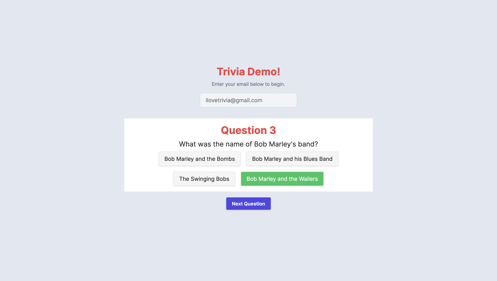
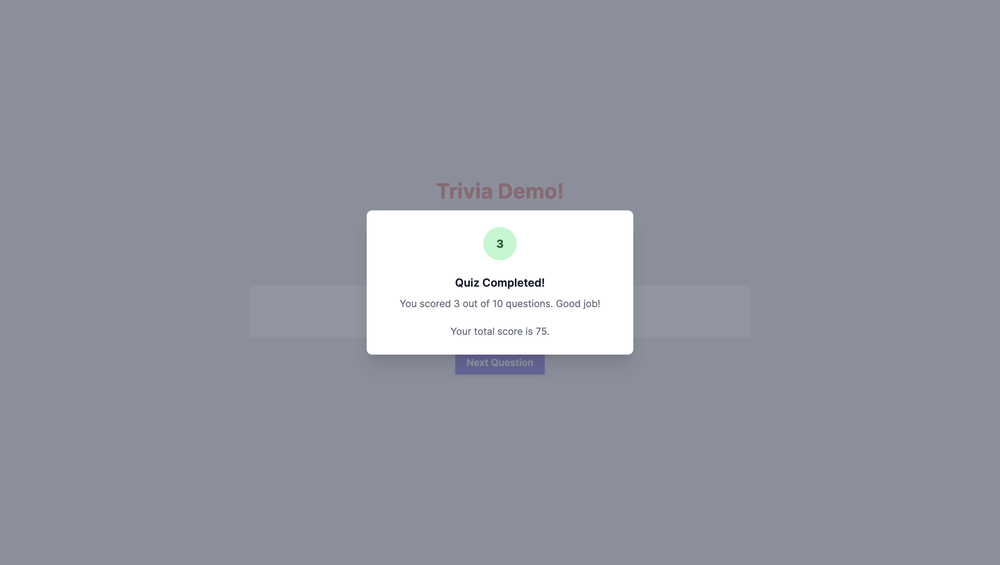

# Trivia Demo Quiz Website

Welcome to the Trivia Demo Quiz Website! This website is designed to showcase a trivia quiz application, allowing users to test their knowledge and have fun answering a variety of questions from different categories. 

## Features

- **Fetching Questions From External API:** The trivia demo website is equipped with a feature that allows fetching questions from an external API. This feature ensures a dynamic and diverse set of questions for the quiz. The API integration enables the retrieval of trivia questions, including the question itself, possible answers, and the correct answer.

- **Randomized Questions:** Each quiz session presents a set of randomized questions to keep the experience fresh and exciting. Users will never know what question will pop up next, making each quiz session unique.

- **Time Limit:** Users are challenged to answer each question within a specific time limit. This feature adds a thrilling element to the quiz as users race against the clock to select the correct answer.

- **Score Tracking:** The website keeps track of the user's score throughout the quiz. After completing the quiz, users can see their final score, and their total score out of all completed quizzes.


## Getting Started

To run the Trivia Demo Quiz Website locally, follow these steps:

1. **Clone the repository:** Start by cloning this repository to your local machine using the following command:

   ```
   git clone https://github.com/your-username/trivia-demo-quiz.git
   ```

2. **Navigate to the project directory:** Move to the cloned repository's directory:

   ```
   cd trivia-demo-quiz
   ```

3. **Install dependencies:** Use a package manager such as npm or yarn to install the project dependencies:

   ```
   npm install
   ```

   or

   ```
   yarn install
   ```

4. **Start the development server:** Once the dependencies are installed, start the development server:

   ```
   npm start
   ```

   or

   ```
   yarn start
   ```

5. **Access the website:** Open your web browser and navigate to `http://localhost:3000` to access the Trivia Demo Quiz Website.

## Technologies Used

The Trivia Demo Quiz Website is built using the following technologies:

- **Front-end:**
  - TypeScript
  - Next.js
  - React.js

- **Back-end:**
  - Node.js

- **Database:**
  - PostgreSQL
  - Kysely

- **APIs:**
  - Open Trivia Database API (https://opentdb.com/api_config.php)

## Screenshots




